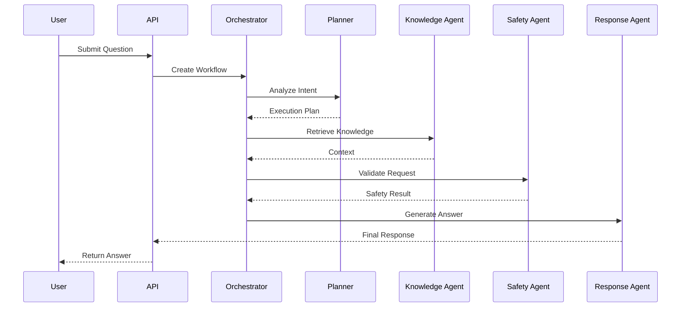

# Agent Execution Flow

```mermaid
sequenceDiagram

    participant U as User
    participant API
    participant O as Orchestrator
    participant P as Planner
    participant K as Knowledge Agent
    participant S as Safety Agent
    participant R as Response Agent

    U->>API: Submit Question

    API->>O: Create Workflow

    O->>P: Analyze Intent

    P-->>O: Execution Plan

    O->>K: Retrieve Knowledge

    K-->>O: Context

    O->>S: Validate Request

    S-->>O: Safety Result

    O->>R: Generate Answer

    R-->>API: Final Response

    API-->>U: Return Answer
```